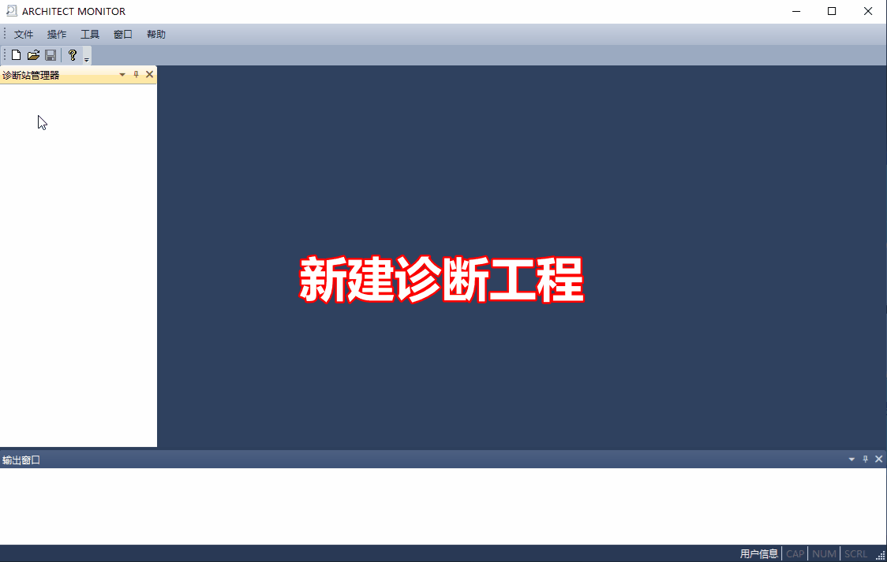
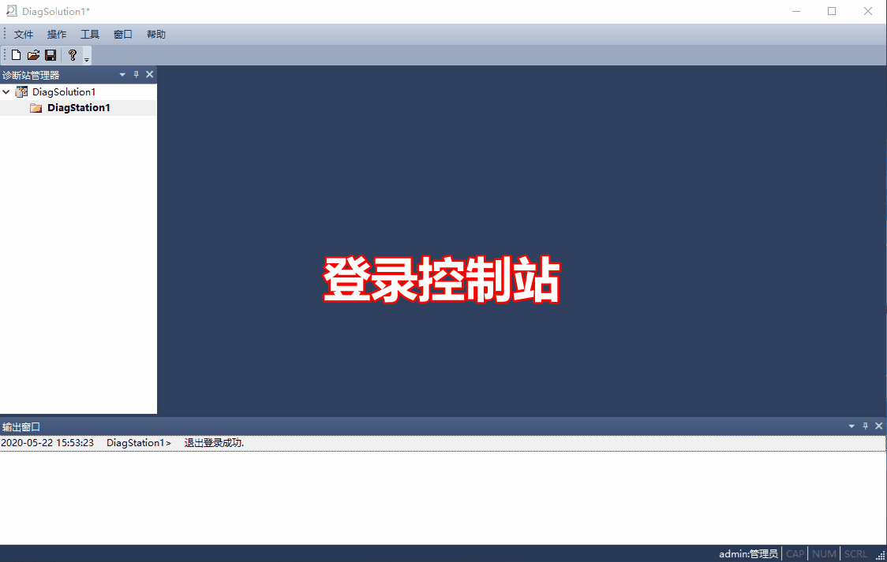

固件升级操作步骤
=====================

PM01模块升级
---------------------

.. hint::
   | -固件文件获取请见 :ref:`最新固件版本`；
   | -此操作将同时升级3个PM01模块，另外两个不需要再次单独升级操作；
   | -如果主机架内，只安装了1块PM01或2块PM01，不会提示升级成功；提示“传输文件完成，升级中...”后，PM01面板上的Fault指示灯开始闪烁，待Fault指示灯灭后，表示升级完成，可以强制关闭Architect Monitor软件；

---------------------------------------------------------------

CM01模块升级
---------------------

.. hint::
   | 固件文件获取请见 :ref:`最新固件版本`；
   | 只针对当前登录的CM01模块进行升级；
   | 如果要升级其它的CM01，需要先使用该CM01模块登录；
   