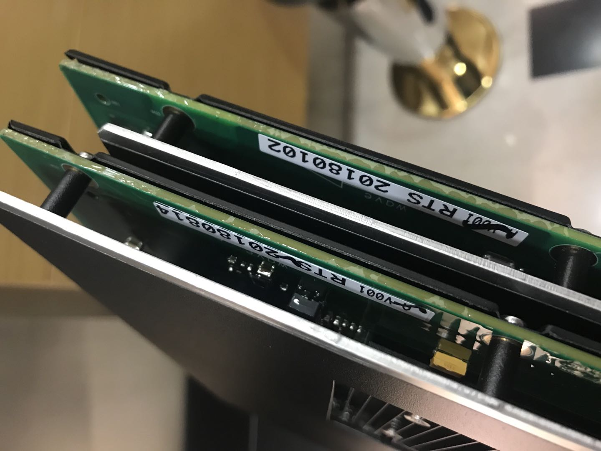

确认模块是否需要升级
=====================

查看模块的固件版本，确认是否需要升级。有两种方法查看固件版本：

#. 使用Architect Monitor软件读取模块的固件版本，参考 :ref:`AM读固件版本`；
#. 查看模块上粘贴的版本标签。标签位置如下：

最新固件版本如下表,如果模块的版本与表中不同，建议更新到此版本。

.. include:: 版本_硬件固件.rst
