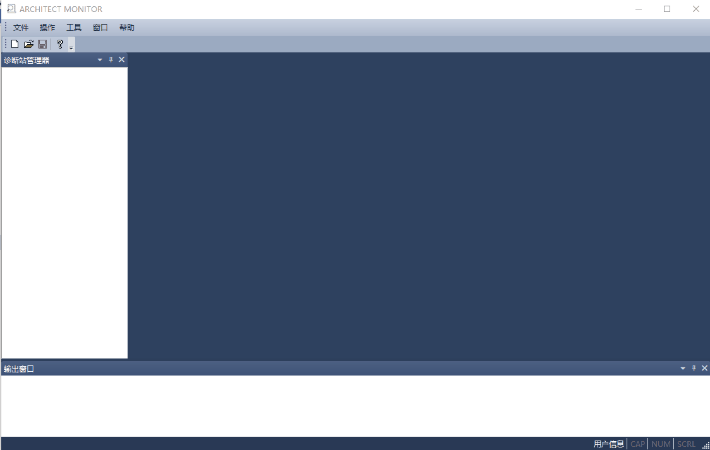

收集日志
=====================

| 1. 新建诊断工程
| 2. 新建站
| 3. 登录控制站
	
   | > 填写要登录的控制器IP地址;
   | > 控制器的默认IP: 192.168.0.1 / 192.168.1.1;

| 4. 菜单项“操作”/“收集日志”；
| 5. 在“日志类型选择”窗口中选择一种类型，开始收集；
| 6. 重复步骤5、6，依次收集全部日志；
| 7. 菜单项“操作”/“退出控制站”；
| 8. 关闭软件；如需协助分析硬件故障，请将收集的诊断日志发邮件到cs@consen.net；

.. hint::
   | 日志类型有User、CM、Core0和Core1，需分别收集；
   | 等待当前类型日志收集完毕后，再收集另一类型日志；
