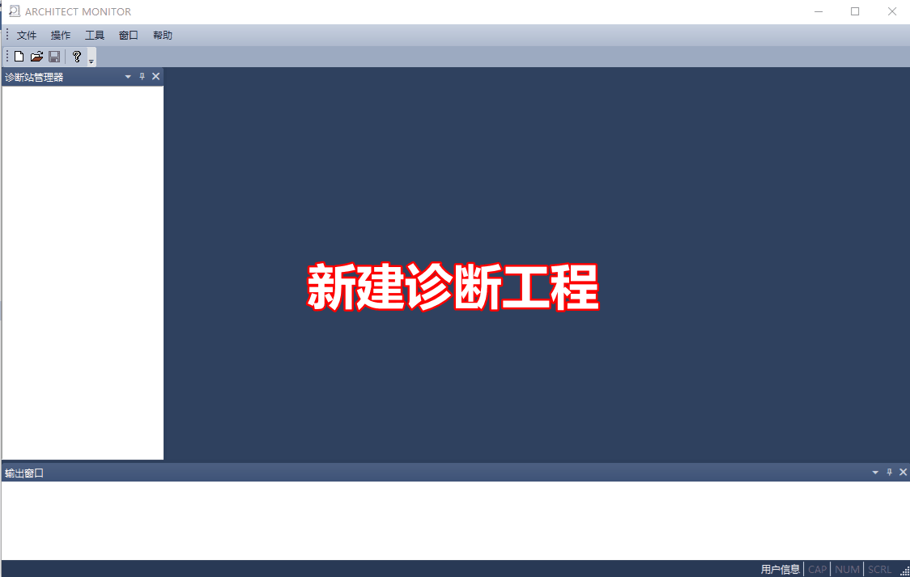

查看模块状态
=====================

| 1. 新建诊断工程
| 2. 新建站
| 3. 登录控制站
	
   | > 填写要登录的控制器IP地址;
   | > 控制器的默认IP: 192.168.0.1 / 192.168.1.1;

| 4. 双击控制站，打开控制站“硬件配置”页面
| 5. 菜单项“操作”/“获取诊断信息”

   | > 在“硬件配置”页面，双击需要查看的模块;
   | > 一般存在报警的模块，有红灯点亮;
