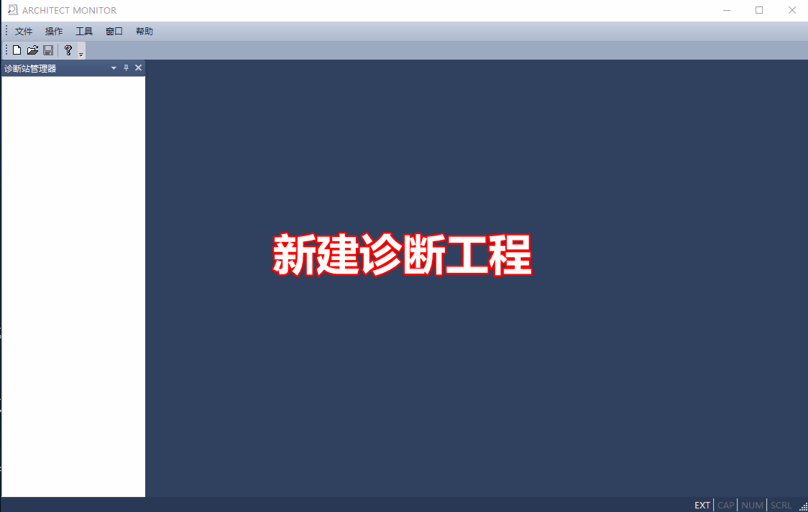

.. _AM读固件版本:

读取固件版本
=====================

| 1. 新建诊断工程
| 2. 新建站
| 3. 登录控制站
	
   | > 填写要登录的控制器IP地址;
   | > 控制器的默认IP: 192.168.0.1 / 192.168.1.1;

| 4. 双击控制站，打开控制站“硬件配置”页面
| 5. 菜单项“操作”/“读取硬件版本”
| 6. 选在“机架x-版本”窗口中选中一条记录，使用键盘快捷键 “Ctrl + A”，选中所有记录，“Ctrl + C”，复制；
| 7. 在“记事本”软件中，使用键盘快捷键 “Ctrl + V”，粘贴记录，然后保存文件；