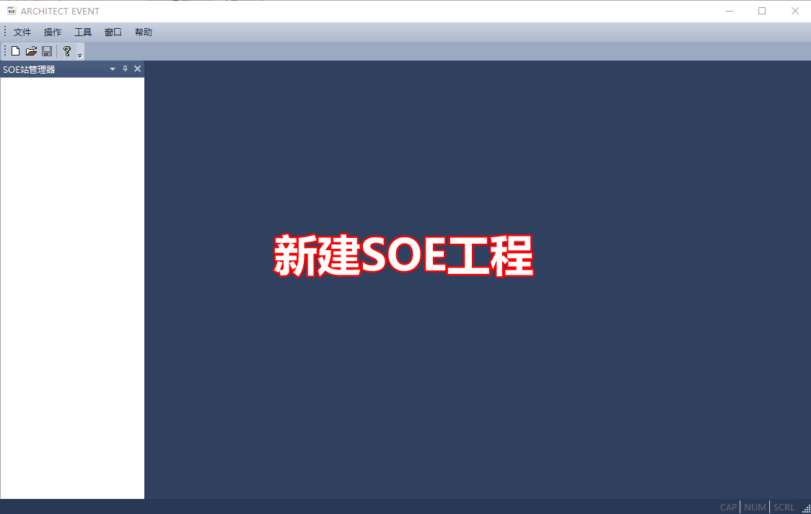

Architect Event
================

仅在Architect Program软件中配置了SOE的功能的变量，在变量值变化时，事件才会被记录下来。配置的步骤请参考 :ref:`软SOE配置`。

收集事件操作
------------------------------------------------------

#. 新建SOE工程
#. 新建站
#. 加载SOE文件
#. 开始收集

------------------------------------------------------

#. 如果读出的事件的时标不正确，请先检查控制器的日期时间是否正确，请参考：  :ref:`查看控制器的日期时间` 。
#. 修改控制器的日期、时间请参考：  :ref:`控制器校时` 。

