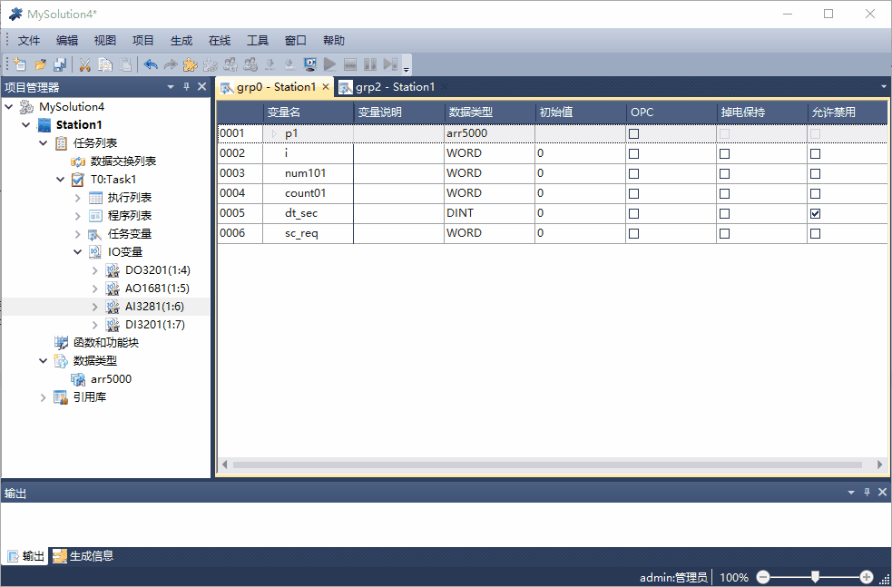
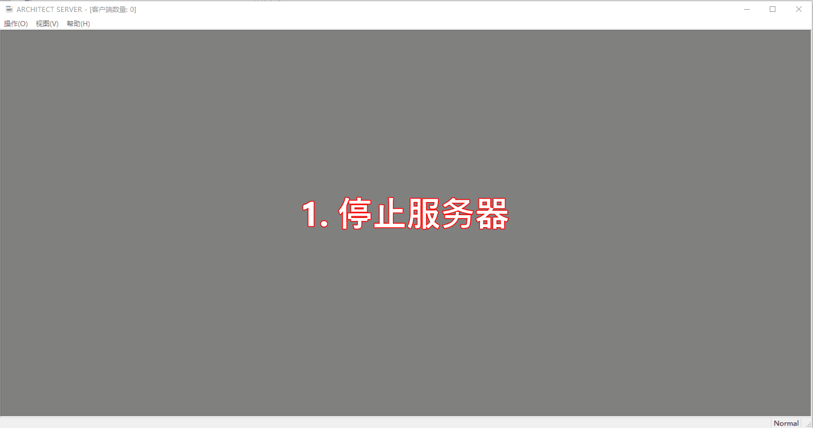

Architect Server
================

配置变量"OPC"属性
--------------------------------------------------------------------

| 首先在Architect Program软件中配置变量的“OPC”(新版本中更改为“外部通讯”)属性；
| “生成”操作，更新Architect Server软件配置所需要的".opc.csv"文件；
| “下装”操作，配置在控制中生效；

-------------------------------------------------------------------------------------------------------

配置Architect Server
--------------------------------------------------------------------

| 1. 停止服务器
| 2. 配置

   | >添加站
   | >填写站名/配置IP地址：读写控制器数据，填写控制器的实际IP；读写本机仿真器数据，填写IP:127.0.0.1;
   | >获取OPC配置文件(注意连接控制器和仿真器的.opc.csv文件路径不同);
   | >添加所有变量到OPC项列表;
   
| 3. 关闭配置界面

-------------------------------------------------------------------------------------------------------

第三方Client测试
--------------------------------------------------------------------

使用第三方的OPC Client，测试OPC Server(Architect Server)是否工作正常:

| 如果Quality列显示不是Good，说明Architect Server与TSxPlus通讯不正常，应：

   | 1. 检查Architect Server配置是否正确；
   | 2. PC与TSxPlus的网络连接是否正常;

