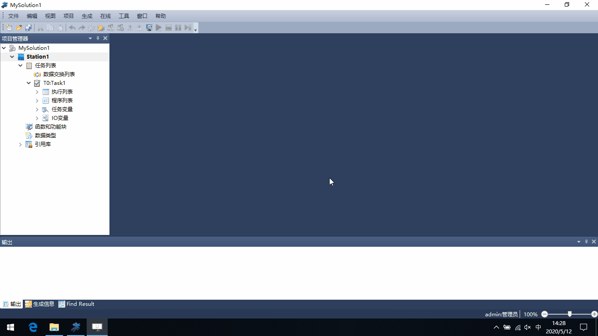

配置CM01串口或网口协议
=============================

串口参数配置
 | 串口协议：Modbus RTU从站;
 | 串口写使能：如果Modbus主站需要向TSxPlus系统中写入数据，配置为TRUE;否则配置为FALSE;
 | Modbus从站地址：与主站协商，需配置为一致的值;
 | 波特率、数据位、停止位、奇偶效验、收发器类型、数据传输顺序：与主站协商，需配置一致;

-------------------------------------------------------------------------------------------------

Modbu TCP参数配置
 | 协议：Modbus TCP从站;
 | 网口写使能：如果Modbus主站需要向TSxPlus系统中写入数据，配置为TRUE;否则配置为FALSE;
 | 数据传输顺序：与主站协商，需配置一致;
 | 允许的IP地址：默认为“0.0.0.0”，允许任意IP的主站访问；
 

