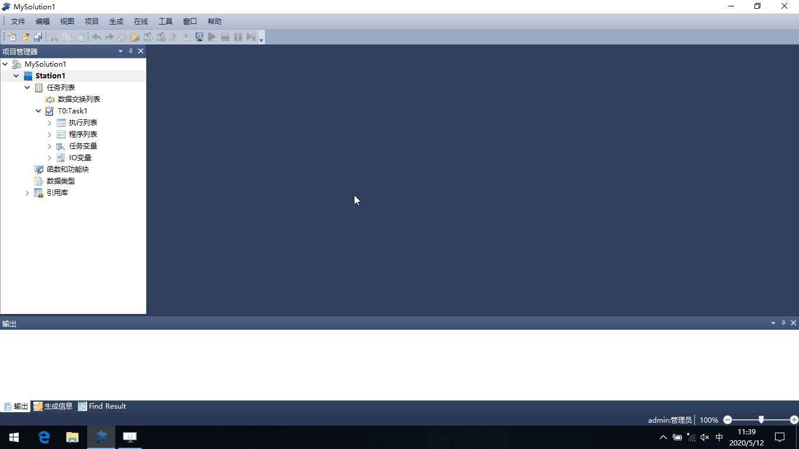
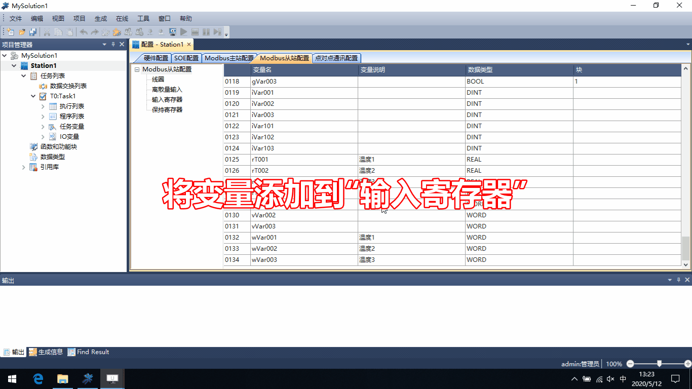
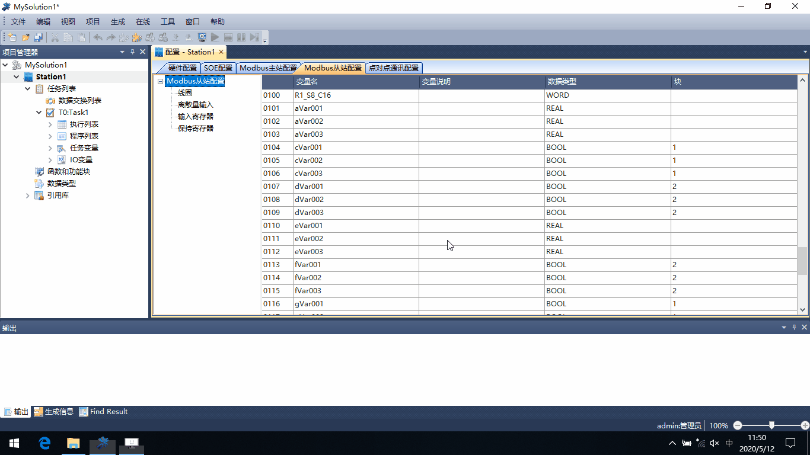
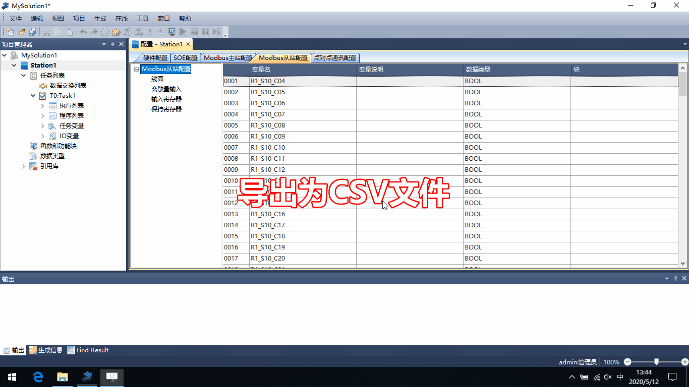

Modbus从站配置-变量和地址
===========================

**1.变量-将需要访问的变量，添加到寄存器区域中**

添加变量到“线圈”和“离散量输入”

--------------------------------------------

添加变量到“输入寄存器”和“保持寄存器”

--------------------------------------------

**2.地址-给变量指定索引(访问地址)**

2.1 自动索引/手动修改索引

2.2 导出为CSV文件，修改后导入

