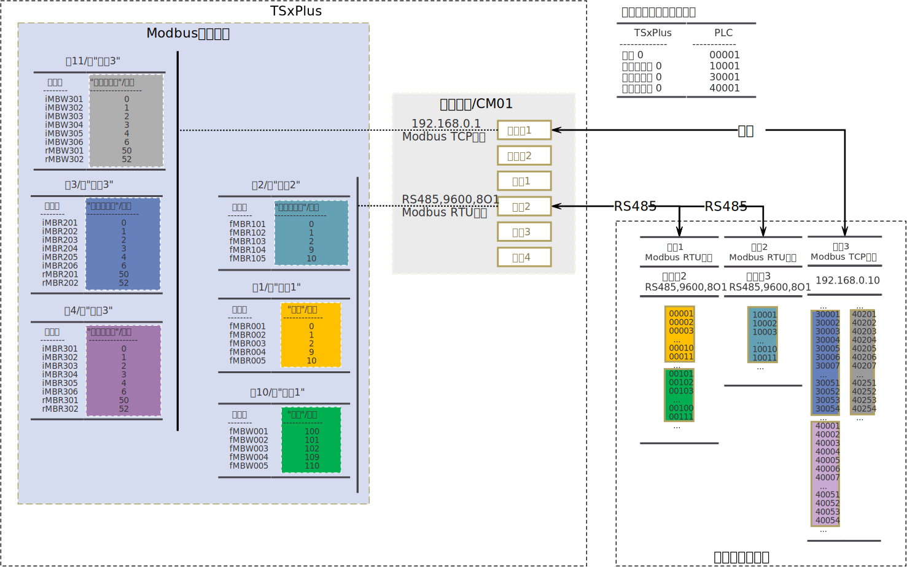
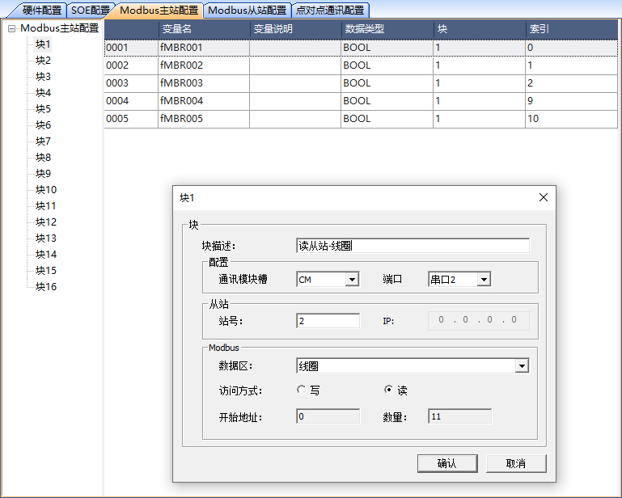
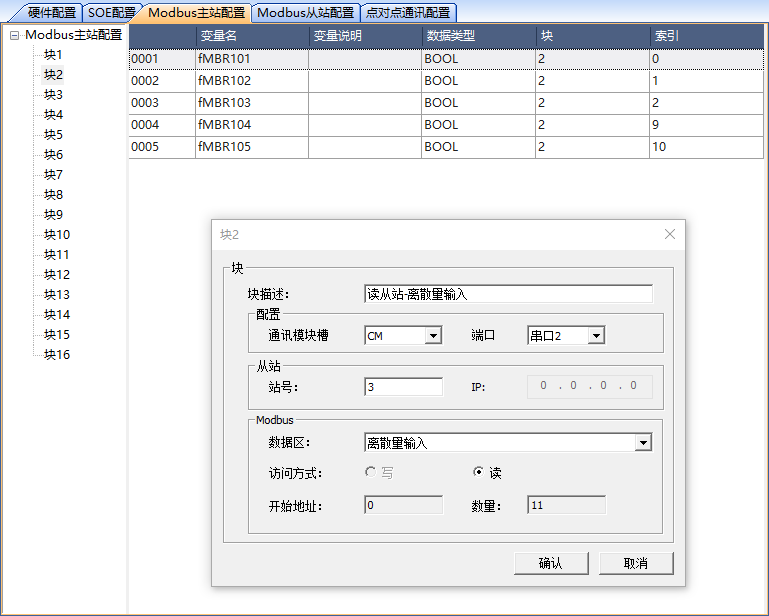
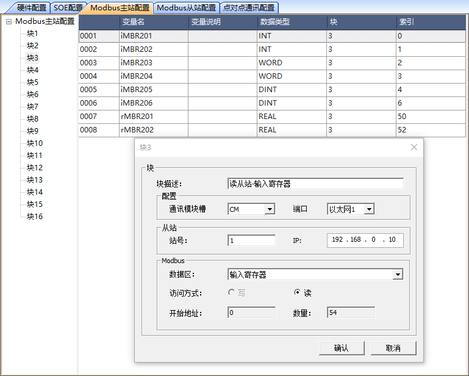
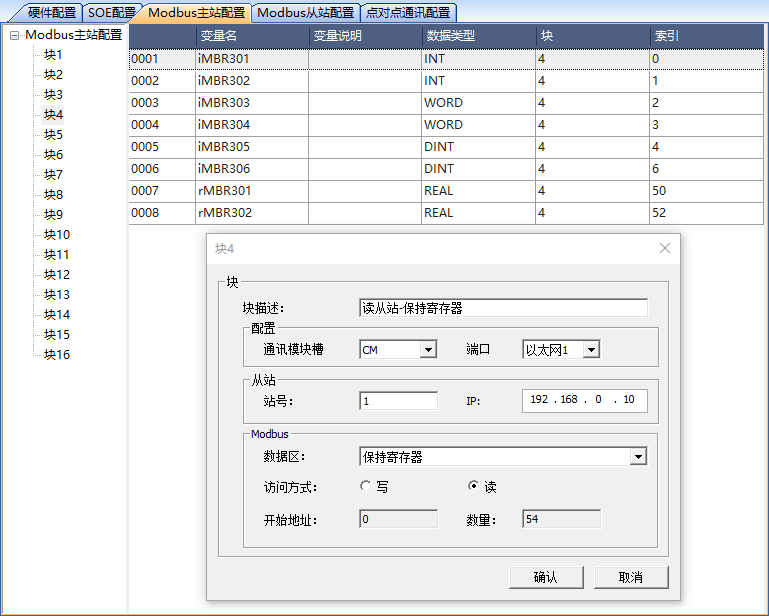
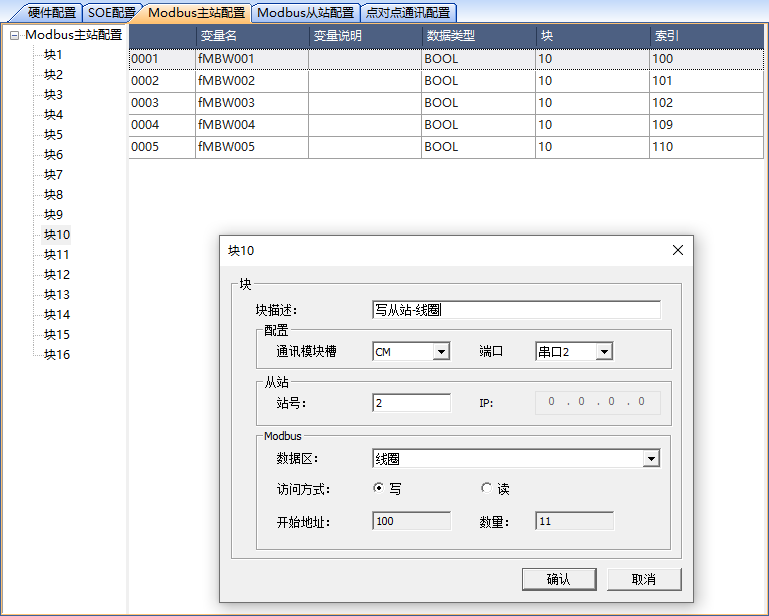
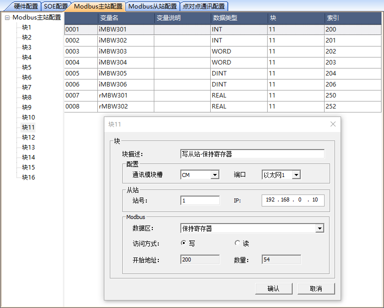

作为Modbus Master
===========================

.. toctree::
   :maxdepth: 2
   
   读从站中数据配置.rst
   向从站中写数据配置.rst
   
---------------------------------------------------------------   

	
---------------------------------------------------------------
   

   块1属性、变量和索引
   
   上图中,块1读取的数据区为“线圈”:变量“fMBR001”的数据类型为“BOOL”，对应的索引值为0，
   TSxPlus系统将读取从站00001地址的值，赋值给变量“fMBR001”;

---------------------------------------------------------------

   块2属性、变量和索引
   
   上图中,块2读取的数据区为“离散量输入”:变量“fMBR101”的数据类型为“BOOL”，对应的索引值为0，
   TSxPlus系统将读取从站10001地址的值，赋值给变量“fMBR101”;
   
---------------------------------------------------------------
   

   块3属性、变量和索引
   
   | 上图中,块3读取的数据区为“输入寄存器”:
   | -变量“iMBR201”的数据类型为“INT”，对应的索引值为0，TSxPlus系统将读取从站30001地址的数值，赋值给变量“iMBR201”；
   | -变量“iMBR203”的数据类型为“WORD”，对应的索引值为2，TSxPlus系统将读取从站30003地址的数值，赋值给变量“iMBR203”；
   | -变量“iMBR205”的数据类型为“DINT”，对应的索引值为4，TSxPlus系统将读取从站30005,30006两个地址的16位的数值，合成一个32位的数值后赋值给变量“iMBR205”；
   | -变量“rMBR201”的数据类型为“REAL”，对应的索引值为50，TSxPlus系统将读取从站30051,30052两个地址的16位的数值，合成一个32位的数值后赋值给变量“rMBR201”；

---------------------------------------------------------------

   块4属性、变量和索引
   
   | 上图中,块4读取的数据区为“保持寄存器”:
   | -变量“iMBR301”的数据类型为“INT”，对应的索引值为0，TSxPlus系统将读取从站40001地址的数值，赋值给变量“iMBR301”；
   | -变量“iMBR303”的数据类型为“WORD”，对应的索引值为2，TSxPlus系统将读取从站40003地址的数值，赋值给变量“iMBR303”；
   | -变量“iMBR305”的数据类型为“DINT”，对应的索引值为4，TSxPlus系统将读取从站40005,40006两个地址的16位的数值，合成一个32位的数值后赋值给变量“iMBR305”；
   | -变量“rMBR301”的数据类型为“REAL”，对应的索引值为50，TSxPlus系统将读取从站40051,40052两个地址的16位的数值，合成一个32位的数值后赋值给变量“rMBR301”；

---------------------------------------------------------------

   块10属性、变量和索引

   上图中,块10写操作的数据区为“线圈”:变量“fMBW001”的数据类型为“BOOL”，对应的索引值为100，
   TSxPlus系统将把变量“fMBW001”的值写入到从站00101地址；

---------------------------------------------------------------

   块11属性、变量和索引
   
   | 上图中,块11写操作的数据区为“保持寄存器”:
   | -变量“iMBW301”的数据类型为“INT”，对应的索引值为200，TSxPlus系统将把变量“iMBW301”的值写入到从站40201地址；
   | -变量“iMBW303”的数据类型为“WORD”，对应的索引值为202，TSxPlus系统将把变量“iMBW303”的值写入到从站40203地址；
   | -变量“iMBW305”的数据类型为“DINT”，对应的索引值为204，TSxPlus系统将把变量“iMBW305”的值写入到从站40205,40206两个地址；
   | -变量“rMBW301”的数据类型为“REAL”，对应的索引值为250，TSxPlus系统将把变量“MBW301”的值写入到从站40251,40252两个地址；