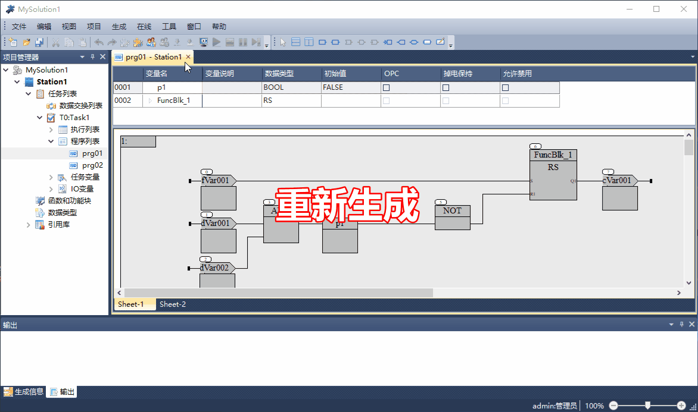
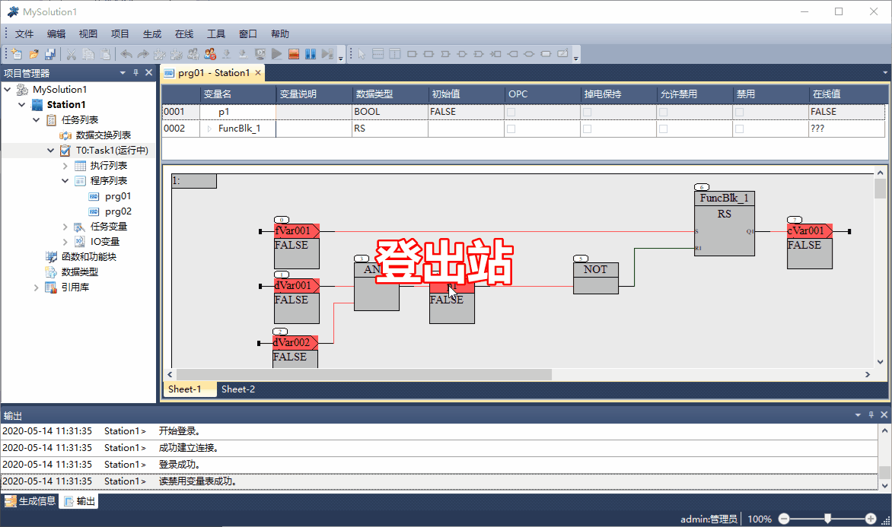

下装操作
==========================

.. attention::
   | 全下装操作，需要控制器处于STOP状态；
   | 若控制器中原来有程序在运行，需将程序切换到STOP状态；

.. topic:: 1. 全下装

   #. 重新生成
   #. 登录站
   #. 全下装
   #. 运行程序

-------------------------------------------------------------

.. topic:: 2. 在线下装

   #. 登出站
   #. 修改程序
   #. 生成
   #. 登录站
   #. 在线下装

