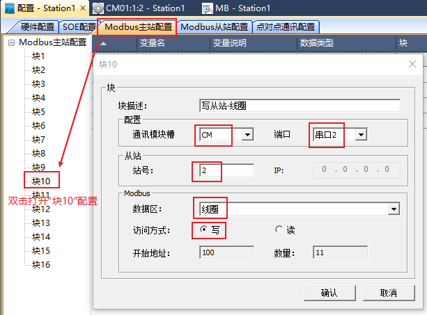
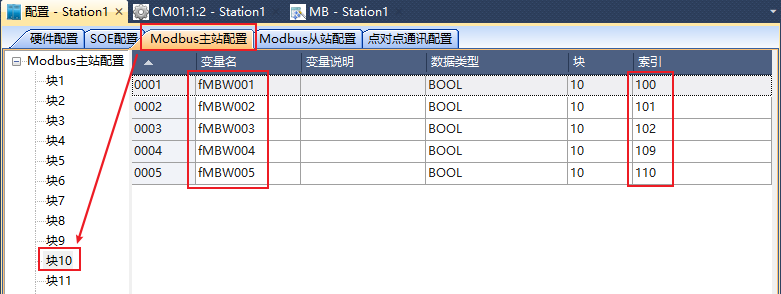
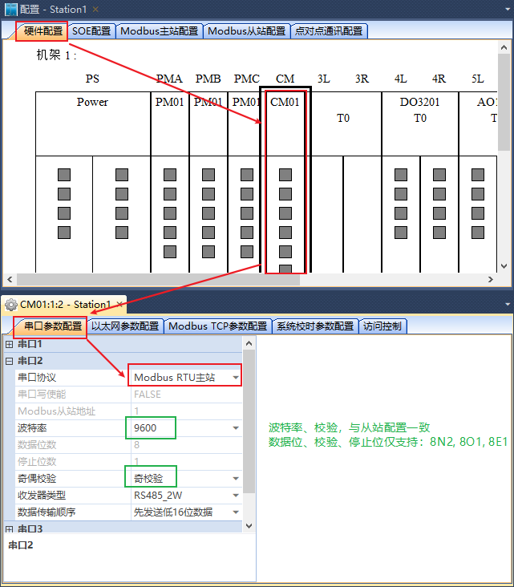
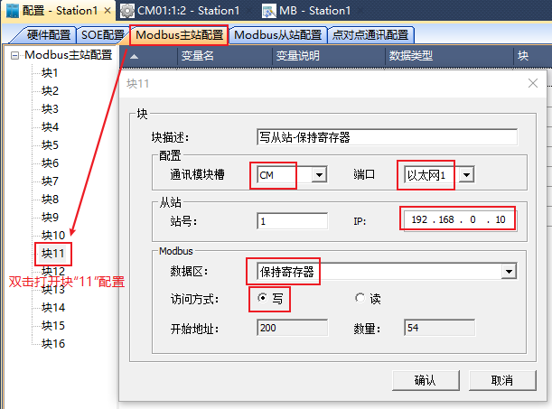
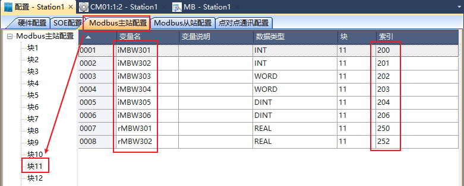
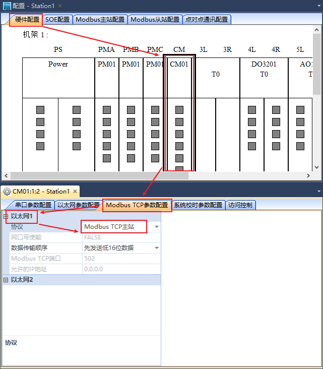

向从站中写数据配置
==================================

TSxPlus可做为Modbus Master（主站），从Modbus Slave（从站）设备中读取数据。

+------------------------------+--------------------------+--------------------------+--------------------------+--------------------------+--------------------------+--------------------------+
|TSxPlus                       |TSxPlus/从站相关                                     |从站相关                  |TSxPlus                                                                         |
+------------------------------+--------------------------+--------------------------+--------------------------+--------------------------+--------------------------+--------------------------+
|通讯口                        |从站号/IP                 |数据区                    |从站PLC地址               |索引                      |变量名称                  |变量类型                  |
+------------------------------+--------------------------+--------------------------+--------------------------+--------------------------+--------------------------+--------------------------+
|串口2                         |2                         |线圈                      |101                       |100                       |fMBW001                   |BOOL                      |
|                              |                          |                          +--------------------------+--------------------------+--------------------------+--------------------------+
|                              |                          |                          |102                       |101                       |fMBW002                   |BOOL                      |
|                              |                          |                          +--------------------------+--------------------------+--------------------------+--------------------------+
|                              |                          |                          |103                       |102                       |fMBW003                   |BOOL                      |
|                              |                          |                          +--------------------------+--------------------------+--------------------------+--------------------------+
|                              |                          |                          |110                       |109                       |fMBW004                   |BOOL                      |
|                              |                          |                          +--------------------------+--------------------------+--------------------------+--------------------------+
|                              |                          |                          |111                       |110                       |fMBW005                   |BOOL                      |
+------------------------------+--------------------------+--------------------------+--------------------------+--------------------------+--------------------------+--------------------------+
|以太网1                       |192.168                   |保持                      |40201                     |200                       |iMBW301                   |INT                       |
|                              |                          |                          +--------------------------+--------------------------+--------------------------+--------------------------+
|                              |.0.10                     |寄存器                    |40202                     |201                       |iMBW302                   |INT                       |
|                              |                          |                          +--------------------------+--------------------------+--------------------------+--------------------------+
|                              |                          |                          |40203                     |202                       |iMBW303                   |WORD                      |
|                              |                          |                          +--------------------------+--------------------------+--------------------------+--------------------------+
|                              |                          |                          |40204                     |203                       |iMBW304                   |WORD                      |
|                              |                          |                          +--------------------------+--------------------------+--------------------------+--------------------------+
|                              |                          |                          |40205                     |204                       |iMBW305                   |DINT                      |
|                              |                          |                          +--------------------------+--------------------------+--------------------------+--------------------------+
|                              |                          |                          |40207                     |206                       |iMBW306                   |DINT                      |
|                              |                          |                          +--------------------------+--------------------------+--------------------------+--------------------------+
|                              |                          |                          |40251                     |250                       |rMBW301                   |REAL                      |
|                              |                          |                          +--------------------------+--------------------------+--------------------------+--------------------------+
|                              |                          |                          |40253                     |252                       |rMBW302                   |REAL                      |
+------------------------------+--------------------------+--------------------------+--------------------------+--------------------------+--------------------------+--------------------------+	

-------------------------------------------------------------------------------------------------------------------------------

1. 向从站的“线圈”数据区写值的配置
------------------------------------------------------------------------------------

下面演示使用TSxPlus的CM01模块的“串口2”，向站号为2的从站设备“线圈”数据区写变量的值。
TSxPlus中配置“Modbus主站配置”中的“块10”完成此操作；

1.1 配置“块10”属性

1.2 分配变量到“块10”中，修改索引值

1.3 配置通讯口

-------------------------------------------------------------------------------------------------------------------------------

2. 向从站的“保持寄存器”数据区写值的配置
------------------------------------------------------------------------------------

下面演示使用TSxPlus的CM01模块的“以太网1”，向IP为"192.168.0.10"的从站设备“保持寄存器”数据区”写变量的值。
TSxPlus中配置“Modbus主站配置”中的“块11”完成此操作；

2.1 配置“块11”属性

2.2 分配变量到“块11”中，修改索引值

2.3 配置通讯口

