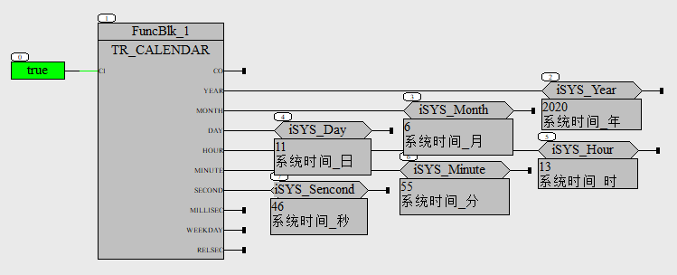
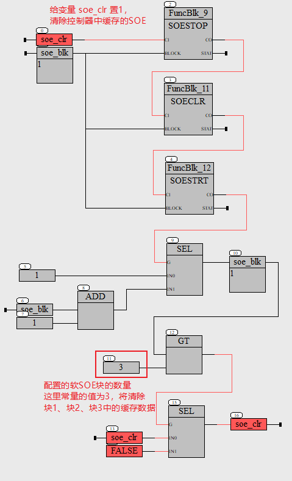
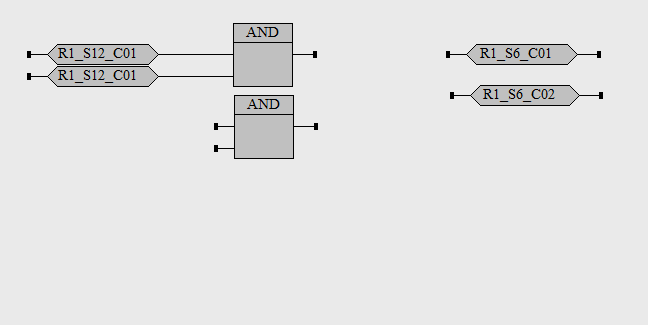
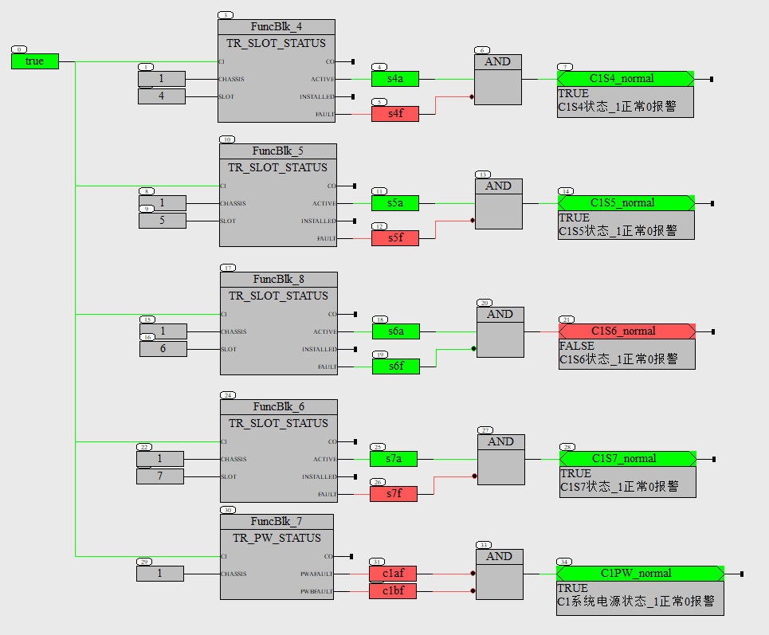
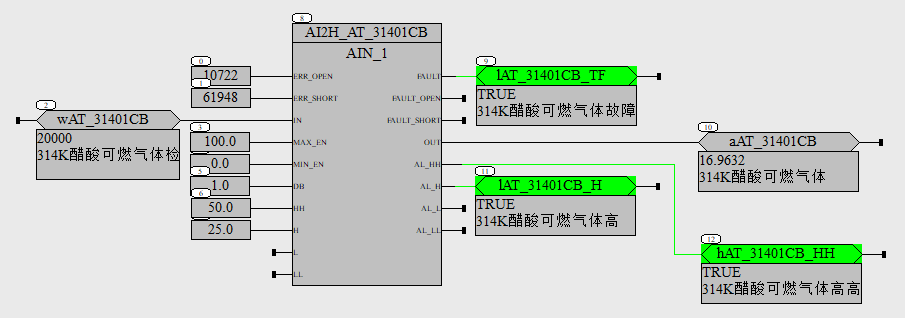
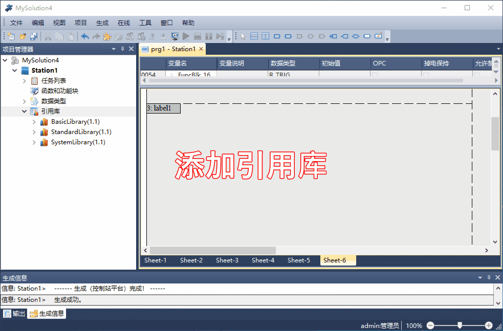

常用功能的演示
==================================

.. _查看控制器的日期时间:

1. 查看控制器的日期时间
----------------------------------

----------------------------------

2. 清除不需要的SOE记录
----------------------------------

----------------------------------

3. 函数/功能块的输出，赋值给两个变量
-------------------------------------

----------------------------------

4. 读取IO模块的诊断状态
----------------------------------

----------------------------------

5. 模拟量转换和报警
----------------------------------

功能块"AIN_1" :download:`点击下载 <./_static/AIN_1.SFBL>`.

AI3281/AO1681模块通道值与电流的对应关系如下：

+----------------------------+----------------------------+
|码值/Raw count              |电流值/mA                   |
+----------------------------+----------------------------+
|65535                       |22                          |
+----------------------------+----------------------------+
|61067                       |20.5                        |
+----------------------------+----------------------------+
|59577                       |20                          |
+----------------------------+----------------------------+
|47662                       |16                          |
+----------------------------+----------------------------+
|35746                       |12                          |
+----------------------------+----------------------------+
|23831                       |8                           |
+----------------------------+----------------------------+
|11915                       |4                           |
+----------------------------+----------------------------+
|10426                       |3.5                         |
+----------------------------+----------------------------+
|0                           |0                           |
+----------------------------+----------------------------+

----------------------------------

6. 添加引用库
----------------------------------

