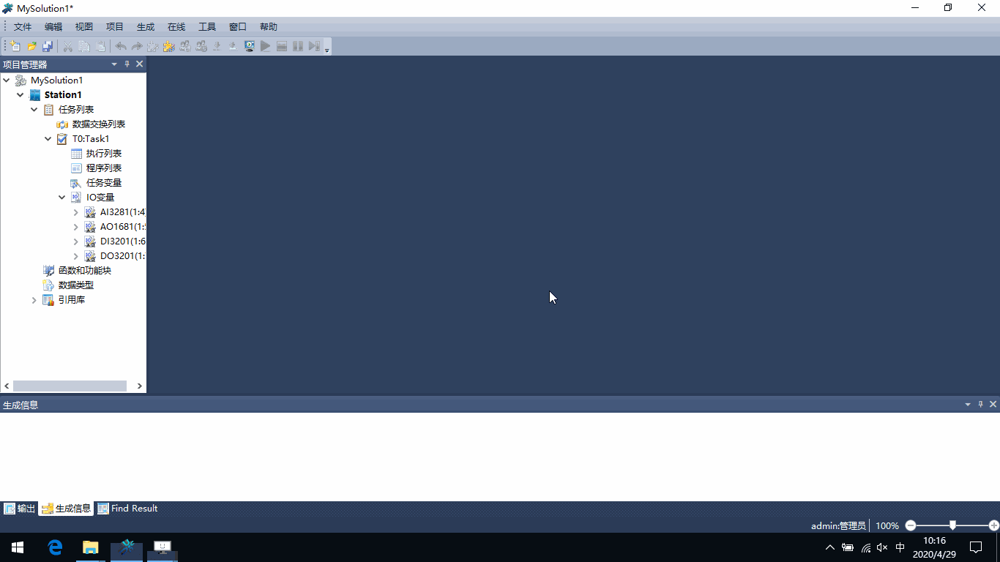
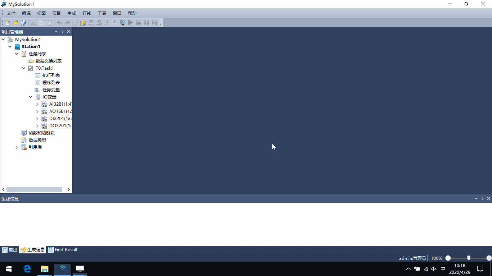
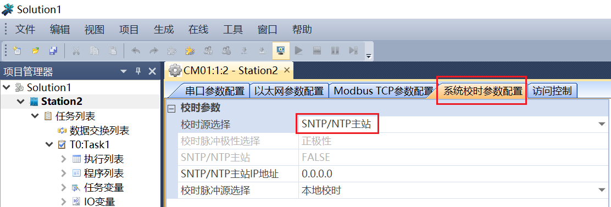
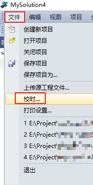
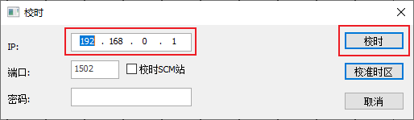
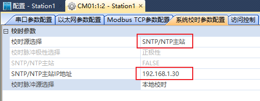

模块参数配置
=========================================

**1. 主处理器模块PM01参数**
-----------------------------------------------

IP_BUS通讯参数/周期通讯从站应答超时时间
 | 默认：120微秒；
 | IP_BUS总线方式扩展：每增加1个扩展机架，配置时间加10微秒；
 | 若光纤的长度超过1km：每增加1km，配置时间增加10微秒；
 
校时脉冲参数/校时脉冲源选择
 | 一般情况下，配置为“PM本地”；
  

---------------------------------------------------------------

**2. IO模块参数**
-----------------------------------------------

IO模块的“xx通道配置”
 | 通道使能：对于没有接端子板的通道，应取消“通道使能”列的选择；
 | 连线诊断使能：对于没有使用的通道，应取消“连线诊断使能”列的选择；
 

---------------------------------------------------------------

.. _控制器校时:

**3. 通讯模块CM01参数**
-----------------------------------------------

3.1 使用Architect Program软件，手动对控制器校时

1. 如下图，“校时源选择”配置为“SNTP/NTP主站”，下装后生效;

2. 在菜单项“文件”中选择“校时...”;

3. 在校时对话框中填写控制器的IP,然后点击“校时”;

---------------------------------------------------------------

3.2 使用SNTP/NTP协议，自动更新控制器日期时间

===================  ===================
配置项				 内容
===================  ===================
校时源选择			 SNTP/NTP主站
SNTP/NTP主站IP地址	 192.168.1.30 [#f1]_
===================  ===================

所使用的SNTP/NTP时钟服务器一般接收GPS、北斗卫星的发出的信号，解析出准确的日期、时间等信息，基于SNTP/NTP协议向客户端设备提供校时服务。
上面的配置实现：TSxPlus作为客户端，周期性的从时钟服务器获取日期、时间。

如果项目中没有SNTP/NTP时钟服务器硬件设备，可配置1台电脑作为SNTP服务器 [#f2]_ ， :download:`点击下载 <./_static/Windows搭建SNTP时钟服务器.pdf>` 配置的方法。

.. rubric:: 注

.. [#f1] 填写时钟服务器的IP地址，TSxPlus必须使用通讯模块CM01的NET2网口与时钟服务器相连接.
.. [#f2] 因电脑时钟精度原因，运行数月后，电脑显示时间与实际时间会有偏差，与这个电脑校时的其它设备的显示时间，也将与实际时间有偏差。推荐使用专用的SNTP/NTP时钟服务器(接收GPS、北斗卫星的发出的信号)给系统校时。

---------------------------------------------------------------

3.3 上位软件利用PC时间，自动更新控制器日期时间

InTouch配置的方法： :download:`点击下载 <./_static/InTouch对TSxPlus校时.pdf>` 

Architect View 2.1配置的方法： :download:`点击下载 <./_static/ArchitectView2.1对TSxPlus校时.pdf>` 

---------------------------------------------------------------

3.4 每天接收一次脉冲信号，对控制器校时 

配置和程序参考： :download:`点击下载 <./_static/每天接收一次脉冲信号对控制器校时.pdf>` 

