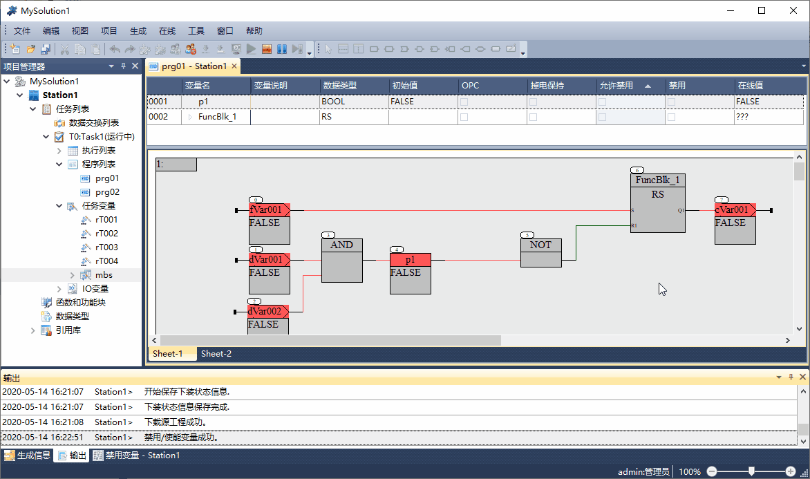
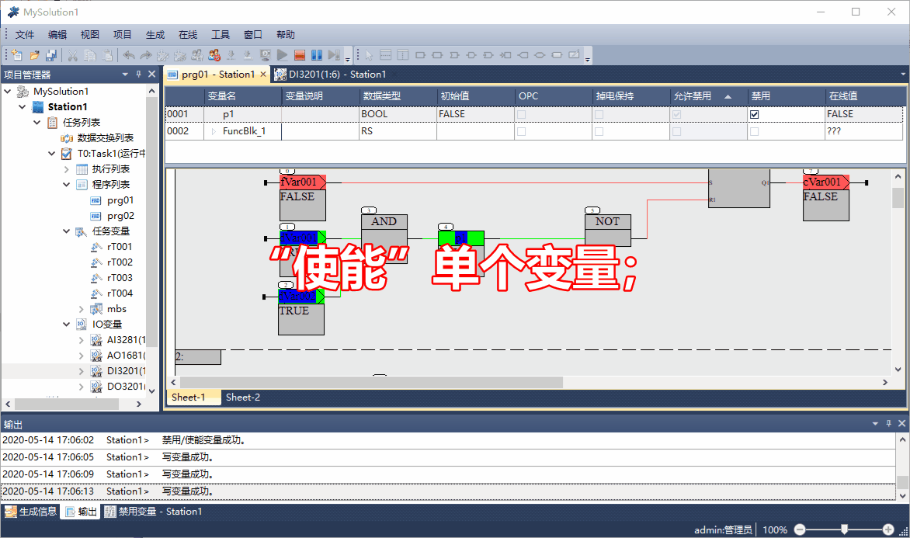

禁用/使能变量
==========================

.. attention::
   | “禁用”变量的操作一般用在项目调试阶段，以方便程序调试；
   | 项目调试完成后，在控制系统投运前，应“使能”所有变量；
   | >禁用状态的AI/DI通道变量的值，将不随实际输入变化；
   | >禁用状态的AO/DO/内部变量的值，将不随程序的运算结果变化；

   
**禁用变量操作**
   

-----------------------------------------------------------------------

**使能变量操作**

