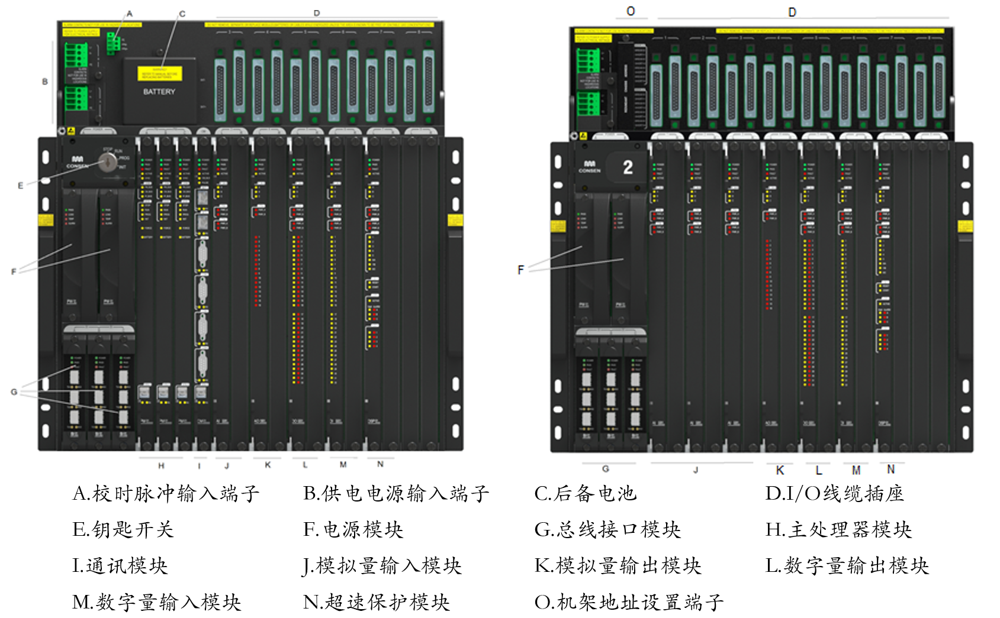
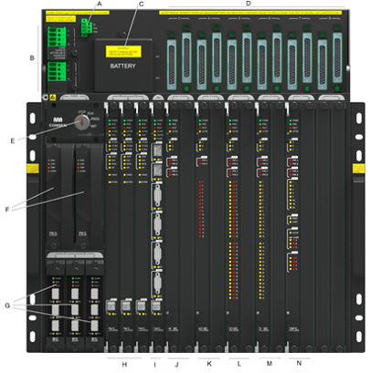
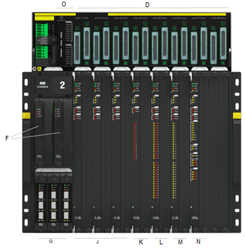

系统硬件组成
==================================

概述
------------------------------------------------------

系统硬件组成包括：机架、各种模块(卡件)、端子板FTA和IO预制电缆等；

   
   左侧为主机架, 右侧为扩展机架;

+------+--------------------------+--------------------------+
|序号  |名称                      |型号                      |
+------+--------------------------+--------------------------+
|一、机架                                                    |
+------+--------------------------+--------------------------+
|1.1   |主机架                    |MC01                      |
+------+--------------------------+--------------------------+
|1.2   |扩展机架                  |EC01                      |
+------+--------------------------+--------------------------+
|二、模块                                                    |
+------+--------------------------+--------------------------+
|2.1   |电源模块                  |PW01                      |
+------+--------------------------+--------------------------+
|2.2   |总线接口模块              |BI01                      |
+------+--------------------------+--------------------------+
|2.3   |主处理器模块              |PM01                      |
+------+--------------------------+--------------------------+
|2.4   |通讯模块                  |CM01                      |
+------+--------------------------+--------------------------+
|2.5   |数字量输入模块            |DI3201                    |
+------+--------------------------+--------------------------+
|2.6   |数字量输出模块            |DO3201                    |
+------+--------------------------+--------------------------+
|2.7   |模拟量输入模块            |AI3281                    |
+------+--------------------------+--------------------------+
|2.8   |模拟量输出模块            |AO1601                    |
+------+--------------------------+--------------------------+
|2.9   |超速保护模块              |OSP01                     |
+------+--------------------------+--------------------------+
|2.10  |伺服控制模块              |SCM01                     |
+------+--------------------------+--------------------------+
|2.11  |振动位移测量模块          |VPM01                     |
+------+--------------------------+--------------------------+
|三、端子板FTA                                               |
+------+--------------------------+--------------------------+
|3.1   |数字量输入端子板          |T-DI1601                  |
+------+--------------------------+--------------------------+
|3.2   |数字量输出端子板          |T-DO1601/T-DO1602/T-DO1603|
+------+--------------------------+--------------------------+
|3.3   |模拟量输入端子板          |T-AI1601/T-AI1602/T-AI3201|
+------+--------------------------+--------------------------+
|3.4   |模拟量输出端子板          |T-AO1601                  |
+------+--------------------------+--------------------------+
|3.5   |OSP数字量端子板           |T-OSP01                   |
+------+--------------------------+--------------------------+
|3.6   |OSP脉冲输入端子板         |T-OSP02                   |
+------+--------------------------+--------------------------+
|3.7   |伺服控制端子板            |T-SCM01                   |
+------+--------------------------+--------------------------+
|3.8   |振动位移端子板            |T-VPM01                   |
+------+--------------------------+--------------------------+
|四、IO预制电缆                                              |
+------+--------------------------+--------------------------+
|4.1   |IO预制电缆(内部双绞)      |CAB-TP-[3/6/10/15]m       |
+------+--------------------------+--------------------------+
|4.2   |IO预制电缆                |CAB-T-[3/6/10/15]m        |
+------+--------------------------+--------------------------+
|五、光纤跳线/SFP光模块                                      |
+------+--------------------------+--------------------------+
|5.1   |多模SFP光模块             |OM-M                      |
+------+--------------------------+--------------------------+
|5.2   |单模SFP光模块             |OM-S                      |
+------+--------------------------+--------------------------+
|5.3   |多模光纤跳线              |CAB-MF-[3/6]m             |
+------+--------------------------+--------------------------+
|5.4   |单模光纤跳线              |CAB-SF-[3/6]m             |
+------+--------------------------+--------------------------+
|六、附件                                                    |
+------+--------------------------+--------------------------+
|6.1   |空面板                    |DUM01                     |
+------+--------------------------+--------------------------+
|6.2   |锂电池                    |LS14500                   |
+------+--------------------------+--------------------------+

主机架系统最小配置
------------------------------------------------------

   
   主机架及机架内的模块;

..  table:: 主机架最小配置

	+------+----------------------+--------------------------+----------+
	|序号  |名称                  |型号                      |数量      |
	+------+----------------------+--------------------------+----------+
	|1     |主机架                |MC01                      |1         |
	+------+----------------------+--------------------------+----------+
	|2     |电源模块              |PW01                      |2         |
	+------+----------------------+--------------------------+----------+
	|3     |总线接口模块          |BI01                      |3         |
	+------+----------------------+--------------------------+----------+
	|4     |主处理器模块          |PM01                      |3         |
	+------+----------------------+--------------------------+----------+
	|5     |通讯模块              |CM01                      |1:4       |
	+------+----------------------+--------------------------+----------+
	|6     |数字量输入模块        |DI3201                    |[0:6]     |
	+------+----------------------+--------------------------+----------+
	|7     |数字量输出模块        |DO3201                    |[0:6]     |
	+------+----------------------+--------------------------+----------+
	|8     |模拟量输入模块        |AI3281                    |[0:6]     |
	+------+----------------------+--------------------------+----------+
	|9     |模拟量输出模块        |AO1681                    |[0:6]     |
	+------+----------------------+--------------------------+----------+
	|10    |超速保护模块          |OSP01                     |[0:6]     |
	+------+----------------------+--------------------------+----------+
	|11    |伺服控制模块          |SCM01                     |[0:6]     |
	+------+----------------------+--------------------------+----------+
	|12    |振动位移测量模块      |VPM01                     |[0:6]     |
	+------+----------------------+--------------------------+----------+
	|13    |空面板                |DUM01                     |6:12      |
	+------+----------------------+--------------------------+----------+
	|14    |端子板FTA             |见"IO模块、端子板和IO电缆"|[0:12]    |
	+------+----------------------+                          +----------+
	|15    |IO预制电缆            |                          |[0:12]    |
	+------+----------------------+--------------------------+----------+

扩展机架系统最小配置
------------------------------------------------------

   
   扩展机架及机架内的模块;

..  table:: 扩展机架最小配置
   
	+------+----------------------+--------------------------+----------+
	|序号  |名称                  |型号                      |数量      |
	+------+----------------------+--------------------------+----------+
	|1     |扩展机架              |EC01                      |1         |
	+------+----------------------+--------------------------+----------+
	|2     |电源模块              |PW01                      |2         |
	+------+----------------------+--------------------------+----------+
	|3     |总线接口模块          |BI01                      |3         |
	+------+----------------------+--------------------------+----------+
	|4     |SFP光模块             |OM-[S/M]                  |6         |
	+------+----------------------+--------------------------+----------+
	|5     |光纤跳线              |CAB-[S/M]-[3/6]m          |3         |
	+------+----------------------+--------------------------+----------+
	|6     |数字量输入模块        |DI3201                    |[0:8]     |
	+------+----------------------+--------------------------+----------+
	|7     |数字量输出模块        |DO3201                    |[0:8]     |
	+------+----------------------+--------------------------+----------+
	|8     |模拟量输入模块        |AI3281                    |[0:8]     |
	+------+----------------------+--------------------------+----------+
	|9     |模拟量输出模块        |AO1681                    |[0:8]     |
	+------+----------------------+--------------------------+----------+
	|10    |超速保护模块          |OSP01                     |[0:8]     |
	+------+----------------------+--------------------------+----------+
	|11    |伺服控制模块          |SCM01                     |[0:8]     |
	+------+----------------------+--------------------------+----------+
	|12    |振动位移测量模块      |VPM01                     |[0:8]     |
	+------+----------------------+--------------------------+----------+
	|13    |空面板                |DUM01                     |8:16      |
	+------+----------------------+--------------------------+----------+
	|14    |端子板FTA             |见"IO模块、端子板和IO电缆"|[0:16]    |
	+------+----------------------+                          +----------+
	|15    |IO预制电缆            |                          |[0:16]    |
	+------+----------------------+--------------------------+----------+

IO模块、端子板和IO电缆
------------------------------------------------------

..  table:: IO模块、端子板FTA和IO预制电缆型号对应关系

	+----------+------------------------------------+----------+-----------------------------------------+-------------------+
	|IO模块型号|IO模块说明                          |端子板型号|端子板说明                               |IO预制电缆         |
	+----------+------------------------------------+----------+-----------------------------------------+-------------------+
	|          | |                                  |T-DI1601  |                                         |                   |
	|DI3201    | | 32通道,数字量输入;               |          |16路数字量输入端子板;                    |CAB-T-[3/6/10/15]m |
	|          | | TYPE 1(IEC61131-2);              |          |                                         |                   |
	|          | | 硬件SOE(1ms);                    |          |                                         |                   |
	+----------+------------------------------------+----------+-----------------------------------------+-------------------+
	|DO3201    |32通道,数字量输出;                  |T-DO1601  | |                                       |CAB-T-[3/6/10/15]m |
	|          |                                    |          | | 16路数字量输出端子板;                 |                   |
	|          |                                    |          | | 24V DC, 1.7A/通道, 5A/16通道;         |                   |
	|          |                                    +----------+-----------------------------------------+                   |
	|          |                                    |T-DO1602  | |                                       |                   |
	|          |                                    |          | | 16路SPDT(单刀双掷)继电器输出端子板;   |                   |
	|          |                                    |          | | 可跳线配置干、湿接点输出类型;         |                   |
	|          |                                    |          | | 每8通道共用1组电源,3A/通道,10安/8通道;|                   |
	|          |                                    +----------+-----------------------------------------+                   |
	|          |                                    |T-DO1603  | |                                       |                   |
	|          |                                    |          | | 16路DPDT(双刀双掷)继电器输出端子板;   |                   |
	|          |                                    |          | | 一组触点输出24V湿接点、另一组干接点;  |                   |
	|          |                                    |          | | 每8通道共用1组电源,2A/通道,10安/8通道;|                   |
	+----------+------------------------------------+----------+-----------------------------------------+-------------------+
	|          | |                                  |T-AI1601  | |                                       |CAB-T-[3/6/10/15]m |
	|AI3281    | | 32通道,4-20mA输入,精度: 0.15%;   |          | | 16路模拟量输入端子板;                 |                   |
	|          | | 硬件SOE(2ms), HART支持;          |          | | 4-20mA输入,通道对外供电保护小于50mA;  |                   |
	|          |                                    +----------+-----------------------------------------+                   |
	|          |                                    |T-AI1602  | |                                       |                   |
	|          |                                    |          | | 16路模拟量输入安全栅端子板;           |                   |
	|          |                                    |          | | 兼容GS4045-EX(电流)/MTL4541/MTL4541A; |                   |
	|          |                                    +----------+-----------------------------------------+                   |
	|          |                                    |T-AI3201  | |                                       |                   |
	|          |                                    |          | | 32路模拟量输入端子板;                 |                   |
	|          |                                    |          | | 4-20mA输入,通道对外供电支持150mA;     |                   |
	+----------+------------------------------------+----------+-----------------------------------------+-------------------+
	|          | |                                  |T-AO1601  | |                                       |CAB-T-[3/6/10/15]m |
	|AO1681    | | 16通道,4-20mA输出,精度: 0.25%;   |          | | 16路模拟量输出端子板;                 |                   |
	|          | | HART支持;                        |          | | 4-20mA输出;                           |                   |
	+----------+------------------------------------+----------+-----------------------------------------+-------------------+
	|          | |                                  |T-OSP01   |(左)数字量端子板; 输入x2，输出x4;        |CAB-T-[3/6/10/15]m |
	|OSP01     | | 超速保护模块;                    +----------+-----------------------------------------+-------------------+
	|          | | PI:8通道, 0.5Hz-32kHz;           |T-OSP02   |(右)8路脉冲输入端子板;                   |CAB-TP-[3/6/10/15]m|
	+----------+------------------------------------+----------+-----------------------------------------+-------------------+
	|          | |                                  |T-SCM01   | |                                       |CAB-TP-[3/6/10]m   |
	|SCM01     | | 伺服控制模块;                    |          | | 测量：2路，3/4/5/6线LVDT，直流电压;   |                   |
	|          | | 4通道LVDT输入，4通道正负电流输出;|          | | 输出：2路，±10/25/50mA;               |                   |
	+----------+------------------------------------+----------+-----------------------------------------+-------------------+
	|          | |                                  |T-VPM01   | |                                       |CAB-TP-[3/6]m      |
	|VPM01     | | 振动位移测量模块;                |          | | 4路振动、位移监测端子板;              |                   |
	|          | | 8通道轴振动、轴位移输入;         |          | | 接收前置器的振动\位移\胀差\转速等信号;|                   |
	+----------+------------------------------------+----------+-----------------------------------------+-------------------+

..  table:: 常用端子板FTA

	+----------+---------------------------------+---------------------------------------+
	|端子板    |图片                             |说明                                   |
	+----------+---------------------------------+---------------------------------------+
	|T-DI1601  | .. image:: images/T-DI1601.png  | |                                     |
	|          |    :scale: 20%                  | | 通道带自恢复保险,红灯亮表示保险动作;|
	|          |                                 |                                       |
	+----------+---------------------------------+---------------------------------------+
	|T-DO1601  | .. image:: images/T-DO1601.png  | |                                     |
	|          |    :scale: 20%                  | | 通道带自恢复保险;                   |
	|          |                                 | 	                                     |
	+----------+---------------------------------+---------------------------------------+
	|T-AI1601  | .. image:: images/T-AI1601.png  | |                                     |
	|          |    :scale: 20%                  | | 通道带自恢复保险,红灯亮表示保险动作;|
	|          |                                 | 	                                     |
	+----------+---------------------------------+---------------------------------------+
	|T-AO1601  | .. image:: images/T-AO1601.png  | |                                     |
	|          |    :scale: 20%                  | |                                     |
	+----------+---------------------------------+---------------------------------------+
	|T-OSP01   | .. image:: images/T-OSP01.png   | |                                     |
	|          |    :scale: 20%                  | | 通道带自恢复保险,红灯亮表示保险动作;|
	|          |                                 | 	                                     |
	+----------+---------------------------------+---------------------------------------+
	|T-OSP02   | .. image:: images/T-OSP02.png   | |                                     |
	|          |    :scale: 20%                  | | 通道带自恢复保险,红灯亮表示保险动作;|
	+----------+---------------------------------+---------------------------------------+
	| |                                                                                  |
	| | 所有端子板需要两路24V DC供电;                                                    |
	| | 绿色指示灯亮表示正常;                                                            |
	+------------------------------------------------------------------------------------+	