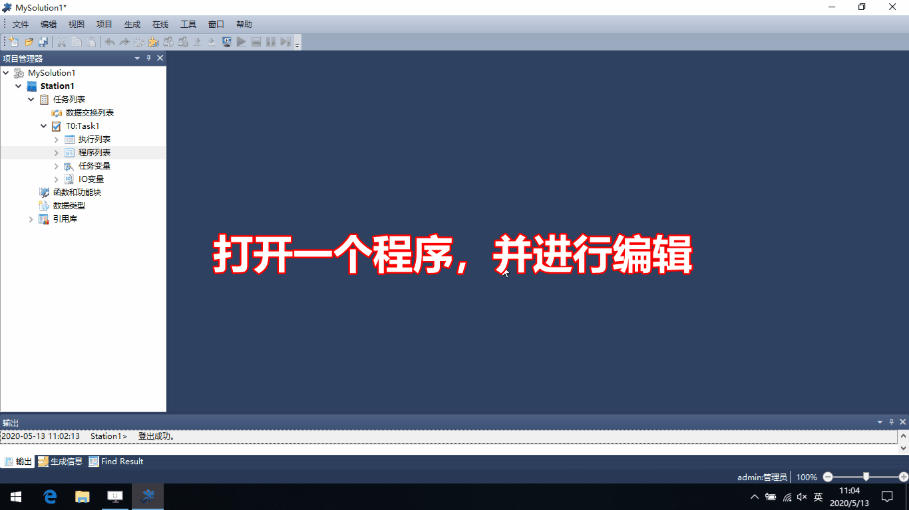
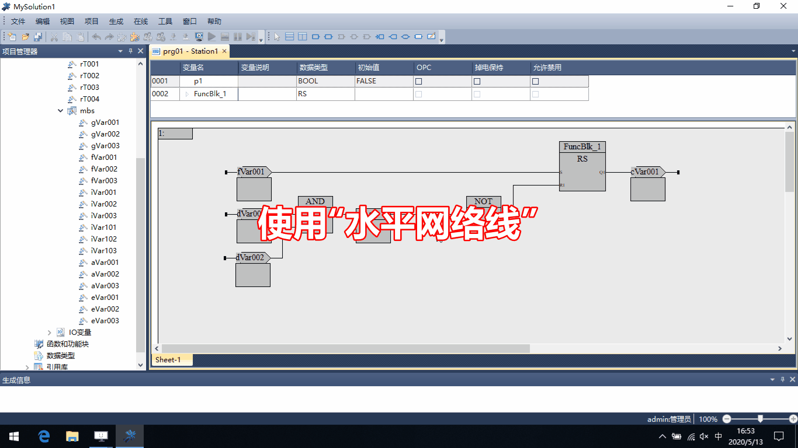
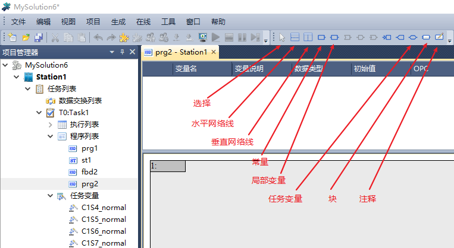

编写/修改程序
==========================

.. topic:: (以功能块图FBD方式为例)

   #. 使用任务变量/IO变量
   #. 使用程序变量
   #. 使用基本指令
   #. 使用“引用库”中的“功能块”

--------------------------------------------

#. 使用“网络线”
#. 添加页面
#. 修改程序页面的属性

.. 添加引用库

--------------------------------------------

工具栏常用命令

