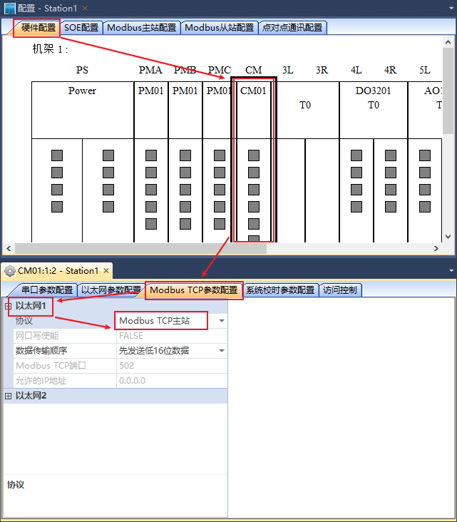

读从站中数据配置
==================================

TSxPlus可做为Modbus Master（主站），从Modbus Slave（从站）设备中读取数据。

+------------------------------+--------------------------+--------------------------+--------------------------+--------------------------+--------------------------+--------------------------+
|TSxPlus                       |TSxPlus/从站 关                                      |从站相关                  |TSxPlus                                                                         |
+------------------------------+--------------------------+--------------------------+--------------------------+--------------------------+--------------------------+--------------------------+
|通讯口                        |从站号/IP                 |数据区                    |从站PLC地址               |索引                      |变量名称                  |变量类型                  |
+------------------------------+--------------------------+--------------------------+--------------------------+--------------------------+--------------------------+--------------------------+
|串口2                         |2                         |线圈                      |1                         |0                         |fMBR001                   |BOOL                      |
|                              |                          |                          +--------------------------+--------------------------+--------------------------+--------------------------+
|                              |                          |                          |2                         |1                         |fMBR002                   |BOOL                      |
|                              |                          |                          +--------------------------+--------------------------+--------------------------+--------------------------+
|                              |                          |                          |3                         |2                         |fMBR003                   |BOOL                      |
|                              |                          |                          +--------------------------+--------------------------+--------------------------+--------------------------+
|                              |                          |                          |10                        |9                         |fMBR004                   |BOOL                      |
|                              |                          |                          +--------------------------+--------------------------+--------------------------+--------------------------+
|                              |                          |                          |11                        |10                        |fMBR005                   |BOOL                      |
|                              +--------------------------+--------------------------+--------------------------+--------------------------+--------------------------+--------------------------+
|                              |3                         |离散量                    |10001                     |0                         |fMBR101                   |BOOL                      |
|                              |                          |                          +--------------------------+--------------------------+--------------------------+--------------------------+
|                              |                          |输入                      |10002                     |1                         |fMBR102                   |BOOL                      |
|                              |                          |                          +--------------------------+--------------------------+--------------------------+--------------------------+
|                              |                          |                          |10003                     |2                         |fMBR103                   |BOOL                      |
|                              |                          |                          +--------------------------+--------------------------+--------------------------+--------------------------+
|                              |                          |                          |10010                     |9                         |fMBR104                   |BOOL                      |
|                              |                          |                          +--------------------------+--------------------------+--------------------------+--------------------------+
|                              |                          |                          |10011                     |10                        |fMBR105                   |BOOL                      |
+------------------------------+--------------------------+--------------------------+--------------------------+--------------------------+--------------------------+--------------------------+
|以太网1                       |192.168                   |输入                      |30001                     |0                         |iMBR201                   |INT                       |
|                              |                          |                          +--------------------------+--------------------------+--------------------------+--------------------------+
|                              |.0.10                     |寄存器                    |30002                     |1                         |iMBR202                   |INT                       |
|                              |                          |                          +--------------------------+--------------------------+--------------------------+--------------------------+
|                              |                          |                          |30003                     |2                         |iMBR203                   |WORD                      |
|                              |                          |                          +--------------------------+--------------------------+--------------------------+--------------------------+
|                              |                          |                          |30004                     |3                         |iMBR204                   |WORD                      |
|                              |                          |                          +--------------------------+--------------------------+--------------------------+--------------------------+
|                              |                          |                          |30005                     |4                         |iMBR205                   |DINT                      |
|                              |                          |                          +--------------------------+--------------------------+--------------------------+--------------------------+
|                              |                          |                          |30007                     |6                         |iMBR206                   |DINT                      |
|                              |                          |                          +--------------------------+--------------------------+--------------------------+--------------------------+
|                              |                          |                          |30051                     |50                        |rMBR201                   |REAL                      |
|                              |                          |                          +--------------------------+--------------------------+--------------------------+--------------------------+
|                              |                          |                          |30053                     |52                        |rMBR202                   |REAL                      |
|                              |                          +--------------------------+--------------------------+--------------------------+--------------------------+--------------------------+
|                              |                          |保持                      |40001                     |0                         |iMBR301                   |INT                       |
|                              |                          |                          +--------------------------+--------------------------+--------------------------+--------------------------+
|                              |                          |寄存器                    |40002                     |1                         |iMBR302                   |INT                       |
|                              |                          |                          +--------------------------+--------------------------+--------------------------+--------------------------+
|                              |                          |                          |40003                     |2                         |iMBR303                   |WORD                      |
|                              |                          |                          +--------------------------+--------------------------+--------------------------+--------------------------+
|                              |                          |                          |40004                     |3                         |iMBR304                   |WORD                      |
|                              |                          |                          +--------------------------+--------------------------+--------------------------+--------------------------+
|                              |                          |                          |40005                     |4                         |iMBR305                   |DINT                      |
|                              |                          |                          +--------------------------+--------------------------+--------------------------+--------------------------+
|                              |                          |                          |40007                     |6                         |iMBR306                   |DINT                      |
|                              |                          |                          +--------------------------+--------------------------+--------------------------+--------------------------+
|                              |                          |                          |40051                     |50                        |rMBR301                   |REAL                      |
|                              |                          |                          +--------------------------+--------------------------+--------------------------+--------------------------+
|                              |                          |                          |40053                     |52                        |rMBR302                   |REAL                      |
+------------------------------+--------------------------+--------------------------+--------------------------+--------------------------+--------------------------+--------------------------+	

-------------------------------------------------------------------------------------------------------------------------------

1. 读“线圈”
---------------------------------------------

下面演示使用TSxPlus的CM01模块的“串口2”，读站号为2的从站设备“线圈”数据区的值。
TSxPlus中配置“Modbus主站配置”中的“块1”完成此操作；

1.1 配置“块1”属性

1.2 分配变量到“块1”中，修改索引值

1.3 配置通讯口

.. image:: images/MBM_COM2.png

-------------------------------------------------------------------------------------------------------------------------------

2. 读“离散量输入”
---------------------------------------------

下面演示使用TSxPlus的CM01模块的“串口2”，读站号为3的从站设备“离散量输入”数据区的变量值。
TSxPlus中配置“Modbus主站配置”中的“块2”完成读数据的操作；

2.1 配置“块2”属性

2.2 分配变量到“块2”中，修改索引值

2.3 配置通讯口

.. image:: images/MBM_COM2.png

-------------------------------------------------------------------------------------------------------------------------------

3. 读“输入寄存器”：整数/实数
---------------------------------------------

下面演示使用TSxPlus的CM01模块的“网口1”，读IP为"192.168.0.10"的从站设备“输入寄存器”数据区的变量值。
TSxPlus中配置“Modbus主站配置”中的“块3”完成读数据的操作；

3.1 配置“块3”属性

3.2 分配变量到“块3”中，修改索引值

3.3 配置通讯口

-------------------------------------------------------------------------------------------------------------------------------

4. 读“保持寄存器”：整数/实数
---------------------------------------------

下面演示使用TSxPlus的CM01模块的“网口1”，读IP为"192.168.0.10"的从站设备“保持寄存器”数据区的变量值。
TSxPlus中配置“Modbus主站配置”中的“块4”完成读数据的操作；

4.1 配置“块4”属性

4.2 分配变量到“块4”中，修改索引值

4.3 配置通讯口

